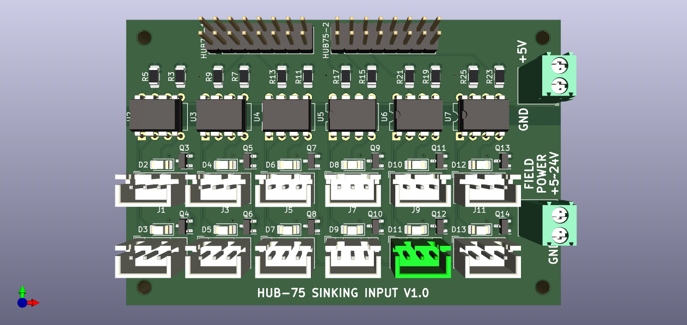
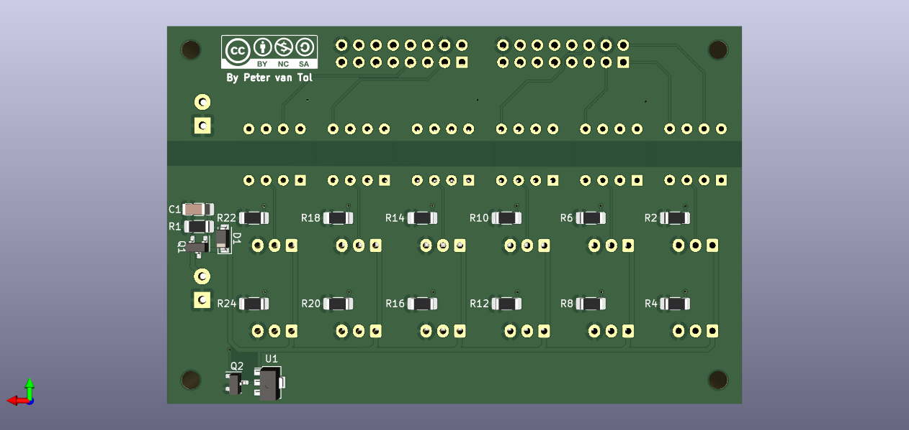
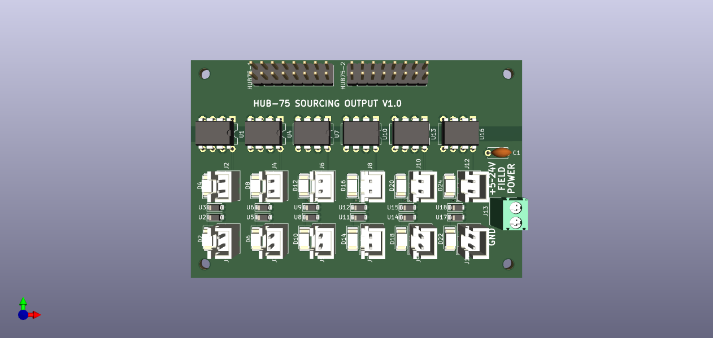
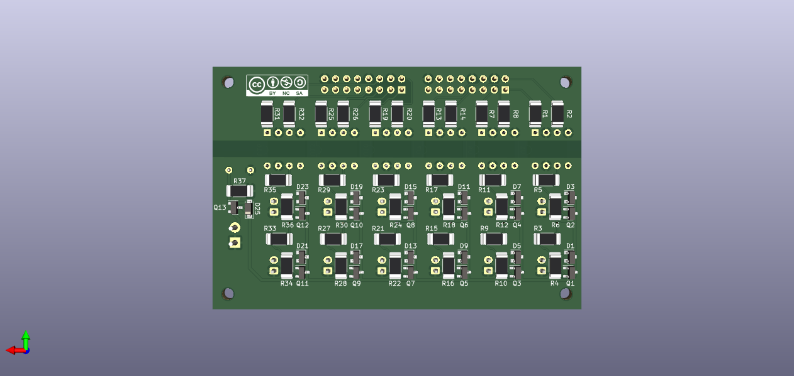

====
GPIO
====

The module ``GPIO`` gives acces to the bare pins of the FPGA. The pins can be configured to be
either inputs (from machine to controller) or outputs (from controller to machine). When using
the GPIO as input requires to modify the buffers on the supported FPGA-cards.

Possible usages are:

  * Limit switches.
  * Push buttons for user panel.
  * Control relays for Mist and Flood cooling.
  * Control spindle direction.

There is no upper limit for the amount of GPIO a single board supports, other then the number of
pins on the board. Communication to and from the board is done using 32-bit wide words, which can
contain information of up to 32 GPIO pins. When more then 32 pins are used for either direction,
a second 32-bit wide word is automatically used to send or retrieve the information.  

Configuration
=============

The configuration of the GPIO consists of separate blocks for GPIO In and GPIO Out. 

.. code-block:: json

  ...
  "modules": [
    ...,
    {
      "module_type": "gpio",
      "instances": [
        {"direction": "out", "pin":"j1:7" , "name":"j1:8" },
      ]
    },
    ...
  ]

Defining the pin is required in the configuration. Optionally one can give the pin a name which
will be used as an alias in HAL. When no name is given, no entry in the file containnig the
aliases will be generated.

.. warning::
  When *inserting* new pins in the list and the firmware is re-compiled, this will lead to a renumbering
  of the HAL-pins. When using numbers, it is therefore **strongly** recommended only to append pins to 
  prevent a complete overhaul of the HAL.

HAL
===

.. note::
    The input and output pins are seen from the module. I.e. the GPIO In module will take an
    value from the machine and will put this on its respective _output_ pins. While the GPIO
    Out module will read the value from it input pins and put the value on the physical pins.
    This might feel counter intuitive at first glance.

Input pins
----------

<board-name>.gpio.<n>.out / <board-name>.gpio.<name>.out (HAL_BIT)
    Drives a physical output pin.

Output pins
-----------

<board-name>.gpio.<n>.in / <board-name>.gpio.<name>.in (HAL_BIT)
    Tracks a physical input pin.
<board-name>.gpio.<n>.in-not / <board-name>.gpio.<name>.in-not (HAL_BIT)
    Tracks a physical input pin, but inverted.

Parameters
----------

<board-name>.gpio.<n>.invert_output / <board-name>.gpio.<name>.invert_output (HAL_BIT)
    Inverts an output pin.

Example
-------

The very simple example below copies the GPIO input on one pin to an GPIO output. The
example uses the ``5a-75e_v#.#_i48o56.json`` firmware. Please change ``#.#`` for the 
correct version of your board.

.. code-block::

    loadrt litexcnc
    loadrt litexcnc_eth connection_string="<ip_address>"
    loadrt threads name1=test-thread period1=10000000

    # SETUP WATCHDOG
    # ==============
    setp test_PWM_GPIO.watchdog.timeout_ns 15000000

    # ADD FUNCTIONS TO THREAD
    # =======================
    addf <board-name>.read test-thread
    addf <board-name>.write test-thread

    # ALIAS THE PINS
    # ==============
    # NOTE: these aliases are automatically generated when building the driver
    # - input
    alias pin   test_PWM_GPIO.gpio.50.in     test_PWM_GPIO.gpio.j8:1.in
    alias pin   test_PWM_GPIO.gpio.50.in-not test_PWM_GPIO.gpio.j8:1.in-not
    alias pin   test_PWM_GPIO.gpio.51.in     test_PWM_GPIO.gpio.j8:2.in
    alias pin   test_PWM_GPIO.gpio.51.in-not test_PWM_GPIO.gpio.j8:2.in-not
    alias pin   test_PWM_GPIO.gpio.52.in     test_PWM_GPIO.gpio.j8:3.in
    alias pin   test_PWM_GPIO.gpio.52.in-not test_PWM_GPIO.gpio.j8:3.in-not
    alias pin   test_PWM_GPIO.gpio.53.in     test_PWM_GPIO.gpio.j8:5.in
    alias pin   test_PWM_GPIO.gpio.53.in-not test_PWM_GPIO.gpio.j8:5.in-not
    alias pin   test_PWM_GPIO.gpio.54.in     test_PWM_GPIO.gpio.j8:6.in
    alias pin   test_PWM_GPIO.gpio.54.in-not test_PWM_GPIO.gpio.j8:6.in-not
    alias pin   test_PWM_GPIO.gpio.55.in     test_PWM_GPIO.gpio.j8:7.in
    alias pin   test_PWM_GPIO.gpio.55.in-not test_PWM_GPIO.gpio.j8:7.in-not
    # - output
    alias pin   test_PWM_GPIO.gpio.56.out           test_PWM_GPIO.gpio.j9:1.out
    alias param test_PWM_GPIO.gpio.56.invert_output test_PWM_GPIO.gpio.j9:1.invert_output
    alias pin   test_PWM_GPIO.gpio.57.out           test_PWM_GPIO.gpio.j9:2.out
    alias param test_PWM_GPIO.gpio.57.invert_output test_PWM_GPIO.gpio.j9:2.invert_output
    alias pin   test_PWM_GPIO.gpio.58.out           test_PWM_GPIO.gpio.j9:3.out
    alias param test_PWM_GPIO.gpio.58.invert_output test_PWM_GPIO.gpio.j9:3.invert_output
    alias pin   test_PWM_GPIO.gpio.59.out           test_PWM_GPIO.gpio.j9:5.out
    alias param test_PWM_GPIO.gpio.59.invert_output test_PWM_GPIO.gpio.j9:5.invert_output
    alias pin   test_PWM_GPIO.gpio.60.out           test_PWM_GPIO.gpio.j9:6.out
    alias param test_PWM_GPIO.gpio.60.invert_output test_PWM_GPIO.gpio.j9:6.invert_output
    alias pin   test_PWM_GPIO.gpio.61.out           test_PWM_GPIO.gpio.j9:7.out
    alias param test_PWM_GPIO.gpio.61.invert_output test_PWM_GPIO.gpio.j9:7.invert_output

    # CONNECT THE INPUT TO OUTPUT
    # ===========================
    # - Connector J8-J9
    net test1_j08_j09 test_PWM_GPIO.gpio.j8:1.in => test_PWM_GPIO.gpio.j9:1.out
    net test2_j08_j09 test_PWM_GPIO.gpio.j8:2.in => test_PWM_GPIO.gpio.j9:2.out
    net test3_j08_j09 test_PWM_GPIO.gpio.j8:3.in => test_PWM_GPIO.gpio.j9:3.out
    net test5_j08_j09 test_PWM_GPIO.gpio.j8:5.in => test_PWM_GPIO.gpio.j9:5.out
    net test6_j08_j09 test_PWM_GPIO.gpio.j8:6.in => test_PWM_GPIO.gpio.j9:6.out
    net test7_j08_j09 test_PWM_GPIO.gpio.j8:7.in => test_PWM_GPIO.gpio.j9:7.out

Break-out boards
================

For the GPIO there are separate break-out boards available for input and output

**input**
Break-out board with `12 channel sinking input <https://github.com/Peter-van-Tol/HUB-75-boards/tree/main/HUB75-Sinking_input>`_. 
The FPGA is galvanically separated from field power using opto-couplers.

**output**
Break-out board with `12 channel sourcing output <https://github.com/Peter-van-Tol/HUB-75-boards/tree/main/HUB75-Sourcing_output>`_. 
The FPGA is galvanically separated from field power using opto-couplers. To enhance the power each channel can deliver, the loads are being switched with a MOSfet (`AO3401A`). 

