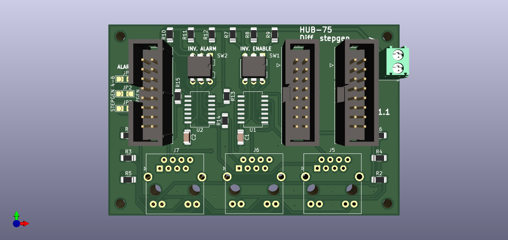

=======
StepGen
=======

The module ``StepGen`` is used to control stepper motors. The maximum step rate is not limited by
software or CPU, but rather by the speed of the FPGA. Based on the FPGA frequency the maximum step frequency
is tuned to be approximately 400 kHz. The maximum step frequency scales linearly with the FPGA frequency

Simlar to the `LinuxCNC stepgen component <https://linuxcnc.org/docs/html/man/man9/stepgen.9.html>`_, 
which has both *position*  and *velocity* modes, the module ``stepgen`` also has positiona and velocity
mode.  The default is position control, which drives the motor to a commanded position, subject to 
acceleration and velocity limits. Velocity control drives the motor at a commanded speed, subject to 
accel and velocity limits. In contrast to the LinuxCNC stepgen component, one can switch between position
and velocity mode during operations.

.. info::
    In the latest version the component ``pos2vel`` has been removed from Litex-CNC and only ``stepgen``
    is required for position mode. If you want to continue to use ``pos2vel`` or ``pid`` to convert
    position to veloctiy, you can keep your current setup when you explicitly set te pin ``velocity-mode``
    to TRUE.

Step types
==========

The firmware of the ``stepgen`` consist of a step generator and a pin out. The pin out is depending on
the kind of step type which is driven by the channel, which may include:

step/dir
    Two pins, one for step and one for direction.
up/down
    Two pins, one for ’step up’ and one for ’step down’.
quadrature
    Two pins, phase-A and phase-B. For forward motion, A leads B.

Step types ``step/dir`` and ``up/down`` can be driven differential. This doubles the amount of physical
pins used (i.e. ``step-`` en ``step+``), but allows for faster driving of the drivers.

Configuration
=============

The code-block belows gives an example for the configuration of ``StepGen`` for different step types

.. tabs::

    .. code-tab:: json
        :caption: step/dir
        
        ...
        "modules": [
            ...,
            {
                "module_type": "stepgen",
                "instance": [
                    {
                        "pins" : {
                            "stepgen_type": "step_dir",
                            "step_pin": "j9:0",
                            "dir_pin": "j9:1"
                        },
                        "max_frequency": 400000,
                        "soft_stop": true
                    },
                ...
                ]
            },
            ...
        ]
        ...

    .. code-tab:: json
        :caption: step/dir (diff.)
        
               ...
        "modules": [
            ...,
            {
                "module_type": "stepgen",
                "instance": [
                    {
                        "pins" : {
                            "stepgen_type": "step_dir_differential",
                            "step_pos_pin": "j9:0",
                            "step_neg_pin": "j9:1",
                            "dir_pos_pin": "j9:2",
                            "dir_neg_pin": "j9:4"
                        },
                        "max_frequency": 400000
                        "soft_stop": true
                    },
                ...
                ]
            },
            ...
        ]
        ...

.. info::
    The maximum frequency in the configuration is the guaranteed maximum frequency the
    stepgen can reach. The actual maximum frequency depends on the clock speed of the
    FPGA and the scaling of this clock powers with a power of 2. 

    The maximum frequency should be chosen to be as close as possible to the maximum
    frequency supported by the drive. Setting this value to a high value would lead
    to reduction in resolution of the speed of the stepgen.

    The field ``max_frequency`` is optional. When not set, it will default to 400 kHz.

HAL
===

.. note::
    The input and output pins are seen from the module. I.e. the GPIO In module will take an
    value from the machine and will put this on its respective _output_ pins. While the GPIO
    Out module will read the value from it input pins and put the value on the physical pins.
    This might feel counter intuitive at first glance.
    
Input pins
----------

<board-name>.stepgen.<index/name>.enable (HAL_BIT)
    Enables output steps - when false, no steps are generated and is the hardware disabled.
<board-name>.stepgen.<index/name>.velocity-mode (HAL_BIT)
    Enables velocity mode. Default value is FALSE, in which case the positon-cmd is translated
    to a required velocity.
<board-name>.stepgen.<index/name>.position-cmd (HAL_FLOAT)
    Commanded position, in length units per second (see parameter position-scale). Only applicable
    when the pin ``velocity-mode`` is set to FALSE.
<board-name>.stepgen.<index/name>.velocity-cmd (HAL_FLOAT)
    Commanded velocity, in length units per second (see parameter position-scale). Only applicable
    when the pin ``velocity-mode`` is set to FALSE.
<board-name>.stepgen.<index/name>.acceleration-cmd (HAL_FLOAT)
    The acceleration used to accelarate from the current velocity to the commanded velocity. Optional
    parameter. When not set, the acceleration-cmd will be equal to the maximum acceleration.

Output pins
-----------

<board-name>.stepgen.<index/name>.counts (HAL_UINT)
    The current position, in counts.
<board-name>.stepgen.<index/name>.position-fb (HAL_FLOAT)
    The received position from the FPGA in units.
<board-name>.stepgen.<index/name>.position-prediction (HAL_FLOAT)
    The predicted position at the start of the next cycle. It is calculated based on the 
    ``position_fb``, and the commanded speeds and acceleration. This HAL-pin should be
     used asfeedback for ``motmod`` to prevent oscillations.
<board-name>.stepgen.<index/name>.speed-fb (HAL_FLOAT)
    The current speed, in units per second.
<board-name>.stepgen.<index/name>.speed-prediction (HAL_FLOAT)
    The predicted speed at the start of the next cycle. It is calculated based on the 
    ``speed_fb``, and the commanded speeds and acceleration.

Parameters
----------

<board-name>.stepgen.<index/name>.frequency (FLOAT / RO)
    The current step rate, in steps per second, for channel N.
<board-name>.stepgen.<index/name>.max-acceleration (FLOAT / RO)
    The acceleration/deceleration limit, in length units per second squared.
<board-name>.stepgen.<index/name>.max-velocity (FLOAT / RO)
    The maximum allowable velocity, in length units per second. 
<board-name>.stepgen.<index/name>.position-scale (FLOAT / RO)
    The scaling for position feedback, position command, and velocity command, in steps per length unit.

There are five timing parameters which control the output waveform.  No step type uses all five, and
only those which will be used are exported to HAL.  The values of these parameters are in nano-seconds,
In the timing diagrams that follow, they are identfied by the following numbers:

1. 'steplen' = length of the step pulse.
2. 'stepspace' = minimum space between step pulses, space is dependent on the commanded speed. The check
   whether the minimum step space is obeyed is done in the driver.
3. 'dirhold_time' = minimum delay after a step pulse before a direction - may be longer
4. 'dir_setup_time' = minimum delay after a direction change and before the next step - may be longer

Timing parameters - step/dir
^^^^^^^^^^^^^^^^^^^^^^^^^^^^
The timing diagram for both ``step/dir`` is shown below. There is no Difference
in timing diagram when differential output is used.

.. code-block::   

               _____         _____               _____
    STEP  ____/     \_______/     \_____________/     \______
              |     |       |     |             |     |
    Time      |-(1)-|--(2)--|-(1)-|--(3)--|-(4)-|-(1)-|
                                          |__________________
    DIR   ________________________________/

The relevant parameters which are exported to the HAL are:

<board-name>.stepgen.<index/name>.steplen (FLOAT)
    The length of the step pulses, in nanoseconds. Measured from rising edge to falling edge.
<board-name>.stepgen.<index/name>.stepspace (FLOAT)
    Space between step pulses, in nanoseconds. Measured from falling edge to rising edge. The 
    actual time depends on the step rate and can be much longer. 
<board-name>.stepgen.<index/name>.dir-hold-time (FLOAT)
    The minimum hold time of direction after step, in nanoseconds. Measured from falling 
    edge of step to change of direction.
<board-name>.stepgen.<index/name>.dir-setup-time (FLOAT)
    The minimum setup time from direction to step, in nanoseconds periods. Measured from 
    change of direction to rising edge of step.
<board-name>.stepgen.<index/name>.max-frequency (FLOAT)
    The maximum frequency the FPGA can generate pulses. This maximum frequency is determined
    based on the ``steplen`` and ``stepspace`` parameters and the fixed point math in the
    FPGA (i.e. protection against rollovers). This frequency can be higher then the maximum
    frequency requested in the JSON configuration file.

Timing parameters - up/down
^^^^^^^^^^^^^^^^^^^^^^^^^^^

Not implemented yet.

Timing parameters - quadrature
^^^^^^^^^^^^^^^^^^^^^^^^^^^^^^

Not implemented yet.

Example
-------

The code below gives an example for a single axis, using the ``step-dir`` step type.

.. code-block::

    loadrt [KINS]KINEMATICS
    loadrt [EMCMOT]EMCMOT servo_period_nsec=[EMCMOT]SERVO_PERIOD num_joints=[KINS]JOINTS
    loadrt litexcnc connections=[LITEXCNC](CONNECTION)

    # Add the functions to the thread
    addf [LITEXCNC](NAME).read servo-thread
    addf motion-command-handler servo-thread
    addf motion-controller servo-thread
    addf [LITEXCNC](NAME).write servo-thread

    [...]

    STEPGEN - X-AXIS
    ########################################################################
    # - Setup of timings
    setp [LITEXCNC](NAME).stepgen.00.position-scale   [JOINT_2]SCALE
    setp [LITEXCNC](NAME).stepgen.00.steplen          5000
    setp [LITEXCNC](NAME).stepgen.00.stepspace        5000
    setp [LITEXCNC](NAME).stepgen.00.dir-hold-time    10000
    setp [LITEXCNC](NAME).stepgen.00.dir-setup-time   10000
    setp [LITEXCNC](NAME).stepgen.00.max-velocity     [JOINT_2]MAX_VELOCITY
    setp [LITEXCNC](NAME).stepgen.00.max-acceleration [JOINT_2]STEPGEN_MAXACCEL
    # setp [LITEXCNC](NAME).stepgen.00.debug 1
    # - Connect velocity command
    net xpos_cmd joint.0.motor-pos-cmd => [LITEXCNC](NAME).stepgen.00.position-cmd
    net xpos_cmd joint.0.motor-pos-fb  <= [LITEXCNC](NAME).stepgen.00.position-prediction
    # - enable the drive
    net xenable joint.0.amp-enable-out => [LITEXCNC](NAME).stepgen.00.enable

Break-out boards
================

For low performance (<1 kHz steprate) the default  `12 channel sourcing output <https://github.com/Peter-van-Tol/HUB-75-boards/tree/main/HUB75-Sourcing_output>`_ can be
used. This might be sufficient for toolchangers are other slow moving devices.

For faster movements, you can either:
- directly connect the output (5 volt) to the stepper driver;
- use the `stepper break-out board <https://github.com/Peter-van-Tol/HUB-75-boards/tree/main/HUB75-Differential_stepgen>`_. This board does not provide any isolation,
  but handles both the enable and alarm signals and provide output with RJ45 connectors.

  

 